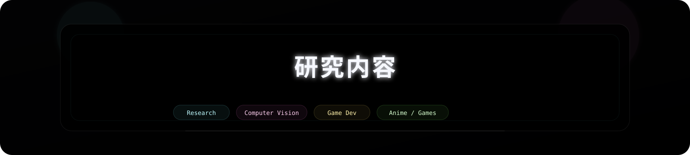
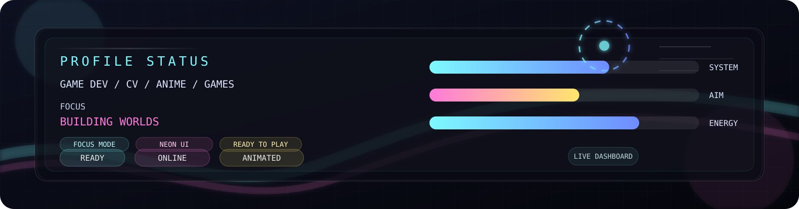
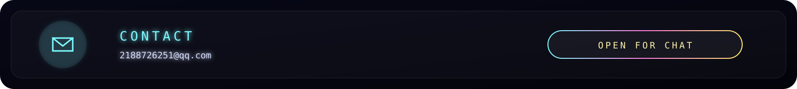

  
PROFILE MODE

  
GAME DEV · COMPUTER VISION · ANIME · GAMES

  
纯动画主页，不展示真实名字，不展示项目。核心内容优先，外层保留赛博启动页氛围。

  

    Game Dev
    Computer Vision
    Anime
    Games
  

 

 
<picture>
  <source media="(prefers-color-scheme: dark)" srcset="https://raw.githubusercontent.com/walnut/walnut/output/github-contribution-grid-snake-dark.svg" />
  <source media="(prefers-color-scheme: light)" srcset="https://raw.githubusercontent.com/walnut/walnut/output/github-contribution-grid-snake.svg" />
  
</picture>

 

